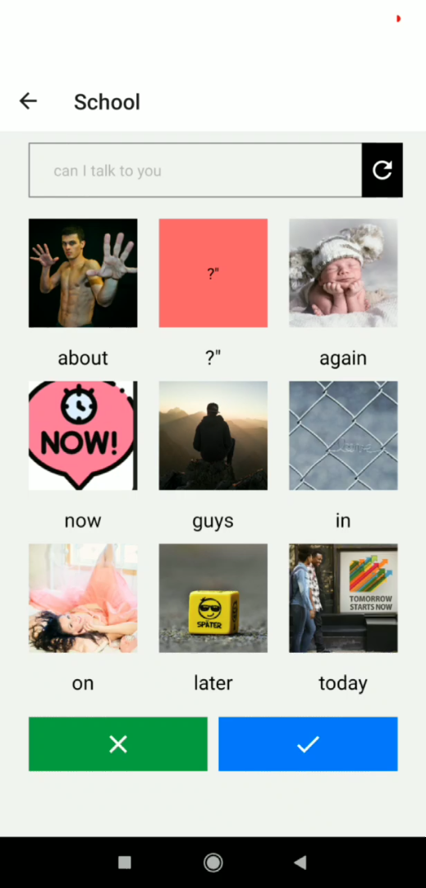
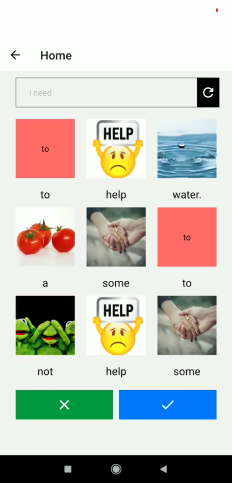
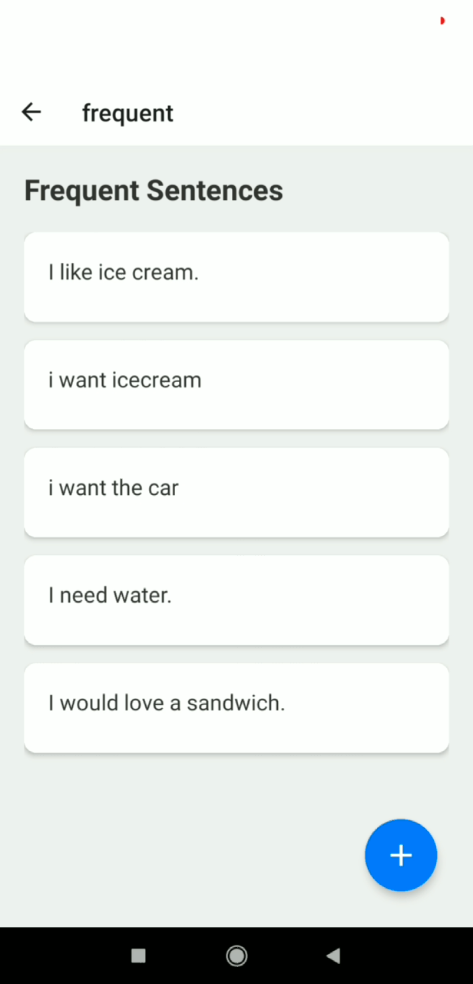

# SpeakPix

An **Augmentative and Alternative Communication (AAC)** mobile application designed to help individuals with autism express themselves through intuitive image-based word selection and AI-powered word prediction.

## Demo

https://github.com/user-attachments/assets/375c08ff-e564-4483-ad2f-52031789d381

## Screenshots

<p align="center">
  
  
  
</p>

| School Scenario | Home Scenario | Frequent Sentences |
|:---:|:---:|:---:|
| Context-aware word suggestions for school environment | Image-based word selection for home needs | Quick access to commonly used phrases |

## Key Features

- **Image-Based Communication**: Select words through visual images, making communication more intuitive and accessible
- **Scenario-Based Contexts**: Switch between environments (Home, School) for contextually relevant word suggestions
- **AI Word Prediction**: GPT-2 powered word prediction that learns from user input patterns
- **Frequent Sentences**: Save and quickly access commonly used phrases for faster communication
- **Smart Caching**: Redis-powered caching for instant image loading and improved performance

## Architecture

```
SpeakPix/
├── backend/                # Flask Backend API
│   ├── main.py             # Main API server
│   ├── history.py          # User history tracking
│   ├── most_repeted_sentences.py  # Frequent phrases logic
│   └── scenerio/           # Scenario-based word sets
│
└── mobile/autism-mobile/   # React Native + Expo App
```

## Tech Stack

| Backend | Frontend |
|---------|----------|
| Flask | React Native |
| Redis | Expo |
| GPT-2 (HuggingFace) | |
| Pixabay API | |

## Getting Started

### Prerequisites

**Backend**
- Python 3.7+
- Redis server
- Pixabay API key

**Mobile App**
- Node.js & npm
- Expo CLI

### Backend Setup

```bash
# Navigate to backend folder
cd backend

# Install dependencies
pip install -r requirements.txt

# Create .env file with:
# API_kEY=your_pixabay_api_key
# REDIS_PASSWORD=your_redis_password

# Start the server
python main.py
```

### Mobile App Setup

```bash
# Navigate to mobile app folder
cd mobile/autism-mobile

# Install dependencies
npm install

# Update the backend API URL in the app to your server's IP address

# Start Expo
npx expo start
```

## API Reference

| Endpoint | Method | Description |
|----------|--------|-------------|
| `/api/images?query=&id=` | GET | Fetch contextual images from Pixabay |
| `/api/guu` | POST | Get AI word predictions (`{"item": "input_text"}`) |
| `/api/display_words?count=` | GET | Retrieve paginated word list |
| `/api/most_repeated_sentence` | GET | Retrieve the top frequently used sentences |

## How It Works

1. **Select a Scenario**: Choose the context (Home, School, etc.) for relevant word suggestions
2. **Build Sentences**: Tap on images to select words and construct sentences
3. **AI Assistance**: The app predicts the next likely words based on your input
4. **Save Favorites**: Frequently used sentences are saved for quick access

## Contributing

1. Fork the repository
2. Create your feature branch (`git checkout -b feature/amazing-feature`)
3. Commit your changes (`git commit -m 'Add amazing feature'`)
4. Push to the branch (`git push origin feature/amazing-feature`)
5. Open a Pull Request

## License

This project was developed during a hackathon. Feel free to use and modify for educational and accessibility purposes.

---

*Built with the goal of making communication accessible for everyone.*
